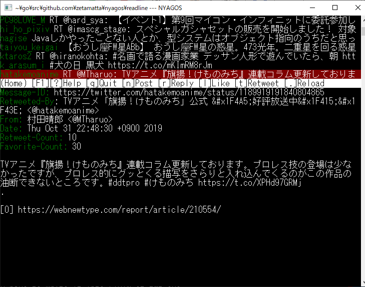

tmt - Twitter Maintenance Tool
==============================

```
tmt [-a ACCOUNT] [-editor EDITORNAME] {subcommand}
```

* view mode
    * `tmt view` ... interactive viewing mode
* show timeline
    * `tmt timeline` ... get home timeline
    * `tmt mention` ... get mention timeline
    * `tmt said` ... show what I said
    * `tmt dump IDNum` ... dump JSON for the tweet
* post
    * `tmt post` ... tweet the contents of STDIN (utf8)
    * `tmt cont` ... tweet in the same thread as the last tweeting
    * `tmt reply IDNum` ... reply to IDNum
* maintainance
    * `tmt followers`  ... list members you are followed
    * `tmt followings`  ... list members you follows
    * `tmt follow` ... follow person listed in STDIN
    * `tmt unfollow` ... follow person listed in STDIN
    * `tmt whoami` ... show who are you

At first you runs `tmt` , your default web-browser shows PIN number.
You have to write it into STDIN of tmt.exe.

In STDIN, please write username like `@ScreenName` per one line.

Install
-------

Download via [Releases](https://github.com/hymkor/tmt/releases) and unzip.

Or if you have scoop-installer,

```
scoop bucket add hymkor https://github.com/hymkor/scoop-bucket
scoop install tmt
```

Build
-----

```
$ go get github.com/hymkor/tmt
$ cd ~/go/src/github.com/hymkor/tmt
$ cd secret
$ cp secret.go.sample secret.go
$ vim secret.go
```

```
package secret

const ConsumerKey = ""
const ConsumerSecret = ""
```

Write the values you get from https://apps.twitter.com/ , and

```
$ cd ..
$ go get ./...
$ go build
```

Author
------
[@hymkor](https://github.com/hymkor)
